# Reliable Webhook Gateway

<!-- Replace YOUR_GITHUB_USERNAME with your GitHub username once the repo is pushed. -->
[](https://github.com/YOUR_GITHUB_USERNAME/webhook-gateway/actions/workflows/ci.yml)

**A FastAPI + PostgreSQL service that ingests third-party webhooks and guarantees they are verified, de-duplicated, ordered, retried, and never lost before delivering them to a configured downstream — using Postgres as the only queue (no Redis, no Celery).**

## Why it exists

Webhooks fail in boring, expensive ways: a forged payload gets trusted, a provider's retry creates a duplicate, an out-of-order update overwrites a newer one, or a downstream outage silently drops events. This gateway sits between providers and your services and closes each of those holes with mechanisms the database itself enforces.

## Features

- **Verified** — HMAC-SHA256 signature check with constant-time comparison.
- **De-duplicated** — a unique constraint + `INSERT … ON CONFLICT DO NOTHING`; correct even under concurrent identical requests.
- **Durable** — the row is committed **before** the `200` is returned, so an accepted webhook is never lost.
- **Ordered** — a per-resource monotonic guard drops stale/out-of-order updates.
- **Retried** — exponential backoff **with jitter**, then a dead-letter queue you can inspect and replay.
- **Concurrent-safe** — workers claim work with `FOR UPDATE SKIP LOCKED`; run as many as you like.

## Architecture

```mermaid
flowchart LR
    P[Provider] -->|POST /v1/webhooks/&#123;source&#125;| API
    subgraph Gateway
      API[FastAPI ingest<br/>verify HMAC → ON CONFLICT insert → COMMIT]
      DB[(Postgres<br/>events = queue + DLQ)]
      W1[Worker 1]
      W2[Worker N]
      API -->|commit before 200| DB
      W1 -->|FOR UPDATE SKIP LOCKED| DB
      W2 -->|FOR UPDATE SKIP LOCKED| DB
    end
    W1 -->|httpx POST| DS[Downstream]
    W2 -->|httpx POST| DS
    OP[Operator] -->|GET /v1/events, POST …/replay| API
```



```
Provider ──POST /v1/webhooks/{source}──▶ API ──commit──▶ ┌──────────────┐
                                          (verify HMAC,   │  Postgres    │
                                           ON CONFLICT,    │  events =    │
                                           persist-then-   │  queue + DLQ │
                                           ACK 200)         └──────┬───────┘
                                                                   │ FOR UPDATE SKIP LOCKED
                                              Worker(s) ◀──────────┘
                                                 │ advisory lock (per resource) → monotonic guard
                                                 └── httpx POST ──▶ Downstream
Operator ── GET /v1/events?status=dead · POST /v1/events/{id}/replay ──▶ API
```

## Data model

- **sources** — `id, name (unique), signing_secret, downstream_url, created_at`
- **events** — `id (uuid pk), source_id (fk), provider_event_id, resource_key, status_ordinal, payload (jsonb), status, attempts, next_attempt_at, last_error, created_at, updated_at`
  with `UNIQUE (source_id, provider_event_id)`.

`status` ∈ `pending · delivering · delivered · failed · dead · superseded`.

## Endpoints

| Method | Path | Purpose |
|---|---|---|
| `POST` | `/v1/webhooks/{source}` | Ingest: verify signature, idempotent insert, return `accepted`/`duplicate`. |
| `GET`  | `/v1/events/{event_id}` | Full event record. |
| `GET`  | `/v1/events?status=&source=&limit=&offset=` | List / inspect the dead-letter queue. |
| `POST` | `/v1/events/{event_id}/replay` | Re-queue a `dead` event (→ `pending`). |
| `POST` | `/v1/sources` | Register a source (admin bearer token). |
| `GET`  | `/healthz` | Liveness/readiness — **fails if the DB is unreachable**. |

### Ingest contract (how event identity is derived)

- `provider_event_id` ← `X-Event-Id` header, else `event_id`, else `id` in the JSON body. **Required** (dedupe needs a stable id) — missing → `400`.
- `resource_key` ← `resource_key` in the body, else the `provider_event_id`.
- `status_ordinal` ← `status_ordinal` in the body, else `0`.

Signature header: `X-Signature: sha256=<hex hmac of the raw body>`.

## Quickstart

```bash
docker compose up --build
```

Brings up Postgres, applies migrations (one-shot `migrate` service), and starts the API + a worker + a throwaway `echo` downstream (httpbin) for the demo.

```bash
curl -s localhost:8000/healthz          # {"status":"ok","database":"ok"}
```

Run **multiple workers** to see concurrency safety:

```bash
docker compose up --scale worker=3
```

## Demo

With the stack up (a short retry budget makes the dead-letter path quick):

```bash
MAX_ATTEMPTS=4 BASE_BACKOFF_SECONDS=1 docker compose up --build -d
./demo/demo.sh
```

Shows: (a) a valid event → `accepted`, (b) the same event → `duplicate`, (c) a forged signature → `401`, (d) a downstream that 500s → retried → `dead`.

## Tests

```bash
docker compose up -d db
docker compose run --rm \
  -e TEST_DATABASE_URL=postgresql+psycopg://gateway:gateway@db:5432/gateway_test \
  api pytest
```

Covers: duplicate → one row · bad signature → 401 · downstream 500 → retried then dead · out-of-order → stale dropped · two concurrent identical requests → still one row (plus replay/inspection and the in-order-still-delivers guard check).

## Configuration

| Env var | Default | Meaning |
|---|---|---|
| `DATABASE_URL` | assembled from `POSTGRES_*` | SQLAlchemy URL (psycopg driver). |
| `ADMIN_TOKEN` | `change-me-admin-token` | Bearer token for `POST /v1/sources`. |
| `MAX_ATTEMPTS` | `6` | Deliveries before dead-lettering. |
| `BASE_BACKOFF_SECONDS` | `2` | Backoff base (grows `base·2^(n-1)`). |
| `MAX_BACKOFF_SECONDS` | `3600` | Backoff cap. |
| `WORKER_POLL_INTERVAL_SECONDS` | `1` | Idle poll sleep. |
| `DELIVERY_TIMEOUT_SECONDS` | `10` | httpx delivery timeout. |

## Failure modes → the mechanism that fixes each

| Failure | Without a gateway | Fix here |
|---|---|---|
| **Forged** payload | attacker-crafted event is trusted | HMAC-SHA256 over the **raw** body, compared with `hmac.compare_digest` (constant-time) → `401`. |
| **Duplicate** (provider re-send / client retry) | processed twice | `UNIQUE (source_id, provider_event_id)` + `INSERT … ON CONFLICT DO NOTHING`; second insert no-ops. |
| **Lost** (crash right after ACK) | provider stops retrying, event gone | Row is **committed before** the `200` (persist-then-ACK); a `200` means it's durably in Postgres. |
| **Out-of-order** (stale update after a newer one) | old state overwrites new downstream | Per-resource advisory lock + monotonic guard: ordinal < max-delivered → `superseded`, never sent. |
| **Downstream down** | events dropped or hammered | Retried with exponential backoff **+ jitter**; nothing is discarded while retries remain. |
| **Poison** (permanently failing event) | worker retries forever / blocks | After `max_attempts` → `dead`; parked in the DLQ, inspectable and replayable. |
| **Double-processing** (2+ workers) | same row delivered twice | `SELECT … FOR UPDATE SKIP LOCKED`; each row is locked by exactly one worker. |

## Design decisions

- **Postgres as the queue (no Redis/Celery).** `FOR UPDATE SKIP LOCKED` turns a table into a safe concurrent work queue, and keeping events in the same transactional store as everything else means "accepted" and "durable" are the *same* commit — no dual-write gap between an HTTP ACK and a queue enqueue.
- **One transaction per event, holding the row lock across the HTTP delivery.** A crashed worker's transaction simply rolls back and the row returns to `pending`/`failed` — there is **no stuck `delivering` state and no reaper to get wrong**. The trade-off (a DB connection held per in-flight delivery) is fine at webhook scale; we scale out with more workers. Delivery is therefore **at-least-once**, which is why ingest dedupes and downstreams should be idempotent.
- **Per-resource advisory lock for ordering.** `pg_advisory_xact_lock(hashtext(resource_key))` serializes same-resource events so the monotonic guard is race-free, while different resources still deliver fully in parallel.
- **Idempotency in the database, not the application.** A check-then-insert races under concurrency; the unique index is the single arbiter.
- **Constant-time secret comparison.** `hmac.compare_digest` for both the webhook signature and the admin token closes a timing side-channel.
- **Backoff with jitter.** Full jitter (`random(0, cap)`) prevents a synchronized thundering herd from re-flattening a downstream the moment it recovers.
- **Native enum + Alembic migrations.** Schema is versioned; `superseded` was added by a later migration (`ALTER TYPE … ADD VALUE` in an autocommit block).
- **One-shot `migrate` service.** api and worker `depends_on` it, so `alembic upgrade head` runs exactly once regardless of replica count (concurrent migrations race on `CREATE TYPE`).
- **Sync SQLAlchemy.** The design leans on row locks and short explicit transactions, which are easier to reason about synchronously; FastAPI runs sync endpoints in a threadpool.
- **Structured JSON logging.** One JSON object per line from both processes, with domain fields (`event_id`, `status`, …) and an `X-Request-ID` correlation header.

## Project layout

```
app/
  main.py            FastAPI app, /healthz, request-logging middleware
  config.py          env-driven settings
  db.py              engine + session factory
  models.py          Source, Event, EventStatus
  security.py        HMAC verify + admin auth (compare_digest)
  ingest.py          field extraction + ON CONFLICT insert
  worker.py          SKIP LOCKED claim → guard → deliver → delivered/failed/dead
  logging_config.py  JSON formatter
  routers/           webhooks.py · sources.py · events.py
migrations/          Alembic (0001 schema, 0002 superseded)
tests/               pytest suite
demo/demo.sh         end-to-end demo
docker-compose.yml   db · migrate · api · worker · echo
```

See **[WALKTHROUGH.md](WALKTHROUGH.md)** for a plain-language trace of one event end-to-end and the "why" behind each mechanism.
